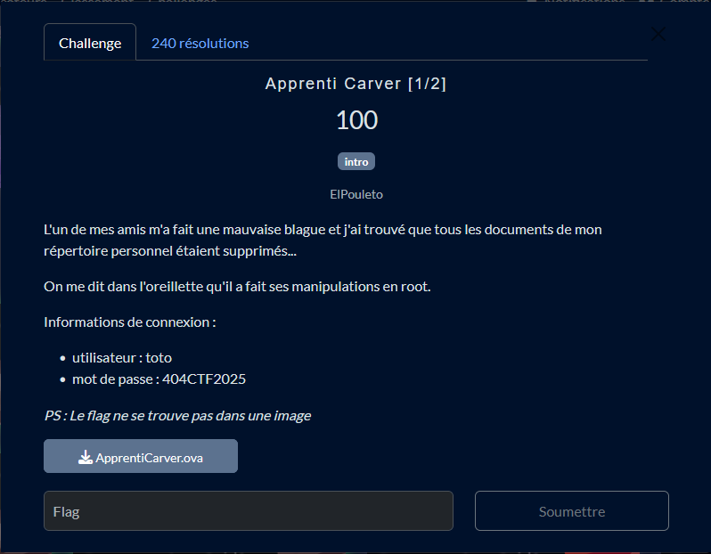
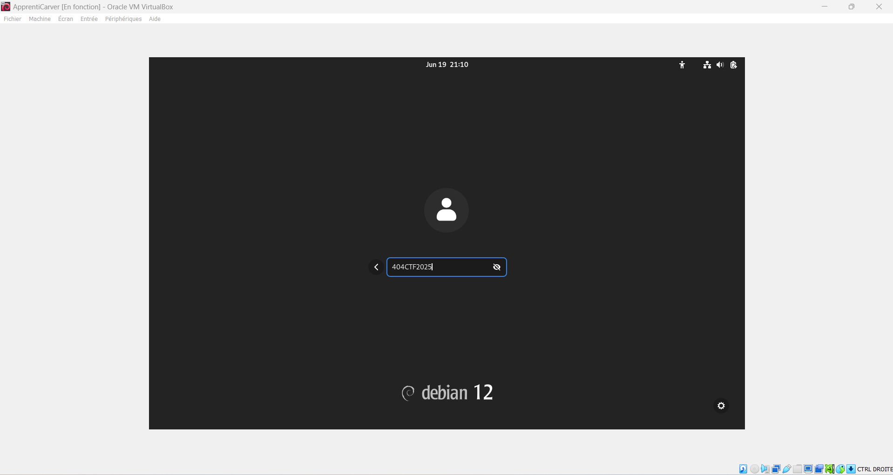
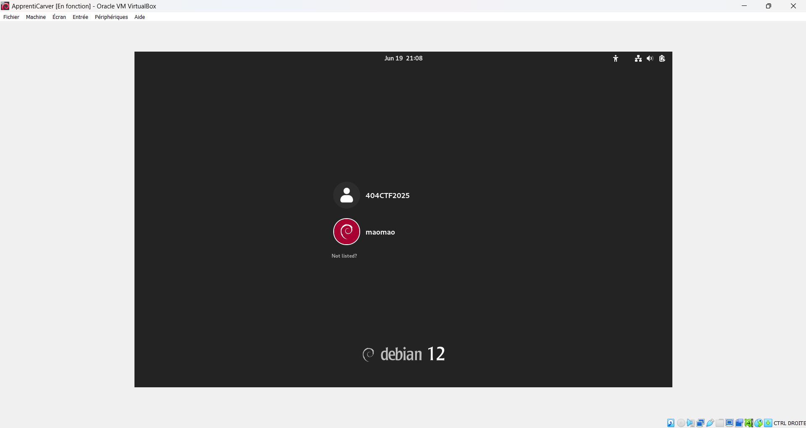
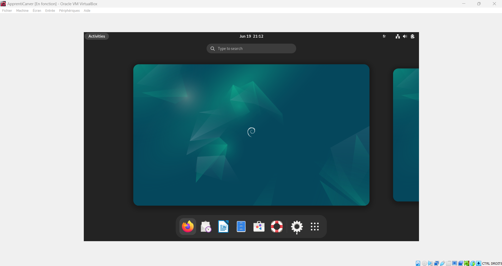
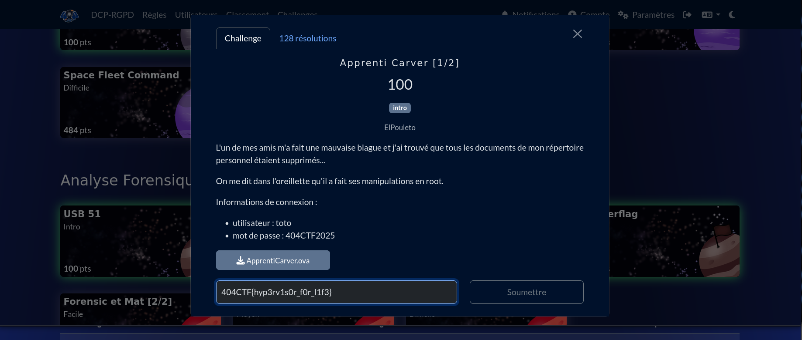
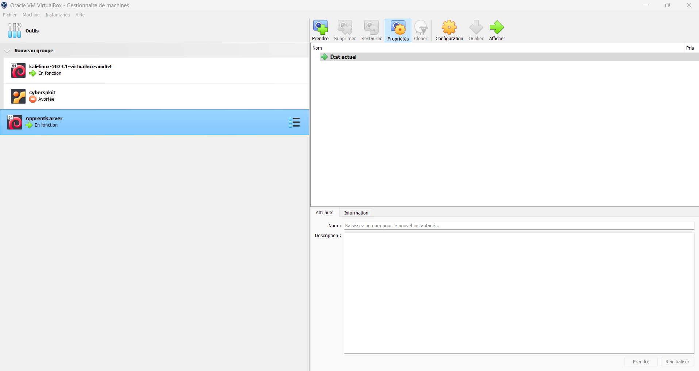
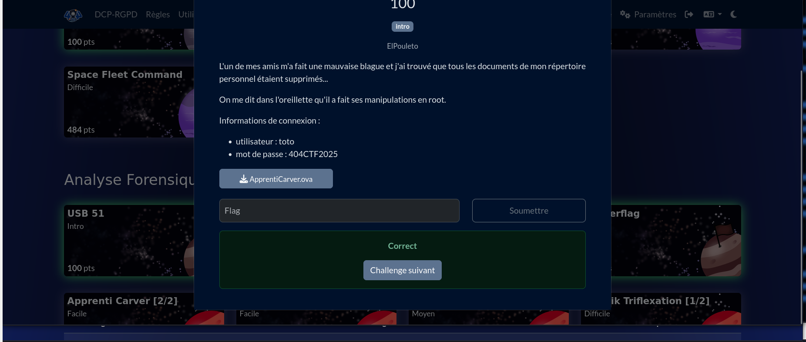

# Solution du challenge : ApprentiCarver 1/2

Bienvenue dans le dépôt de **Analyse Forensique/ApprentiCarver_1_2**.

## Enoncé du sujet








## Fonctionnalités

- **La solution expliquée** : ApprentiCarver_1_2 (Fichier PDF).
- **La synchronisation de source** : ApprentiCarver.ova (VM)
- **La résolution de la source** : README et ApprentiCarver_1_2


## Installation

1. **Cloner le dépôt** :
   ```bash
   git clone https://github.com/JackeOLantern/404CTF2025.git

...
