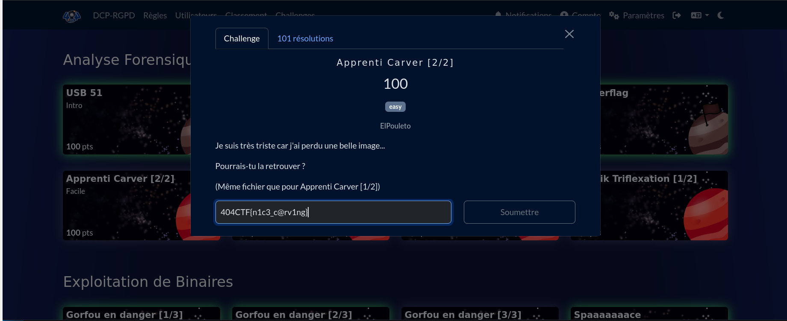
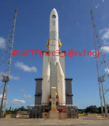
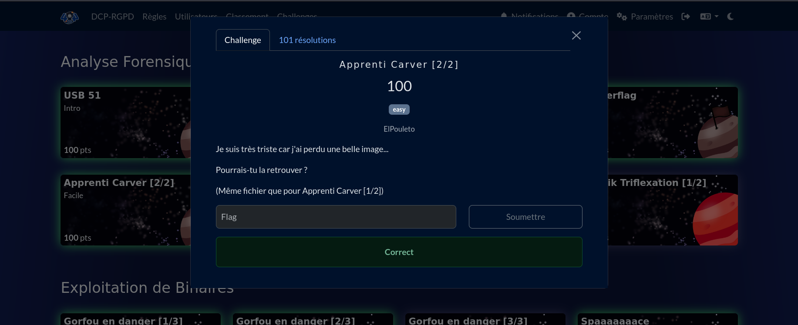

# Solution du challenge : ApprentiCarver 2/2

Bienvenue dans le dépôt de **Analyse Forensique/ApprentiCarver_2_2**.

## Enoncé du sujet




## Fonctionnalités

- **La solution expliquée** : Photo incrustée d'Ariane (vue PDF).
- **La synchronisation de source** : ApprentiCarver.ova (VM)
- **La résolution de la source** : ApprentiCarver_2_2 (PDF)


## Installation

1. **Cloner le dépôt** :
   ```bash
   git clone https://github.com/JackeOLantern/404CTF2025.git

...
