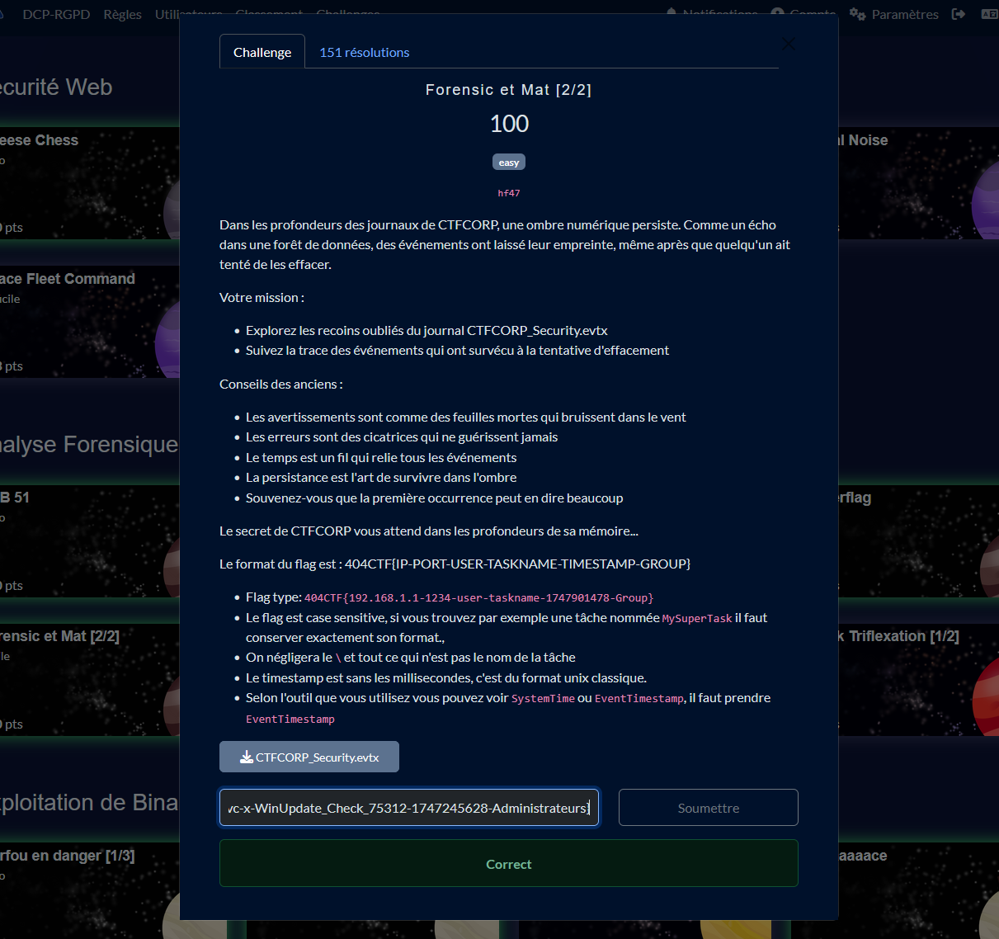
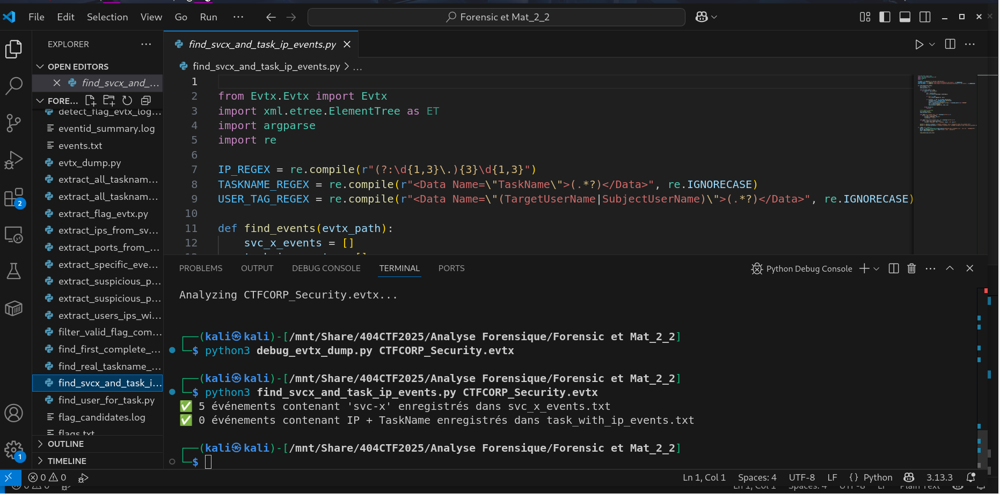
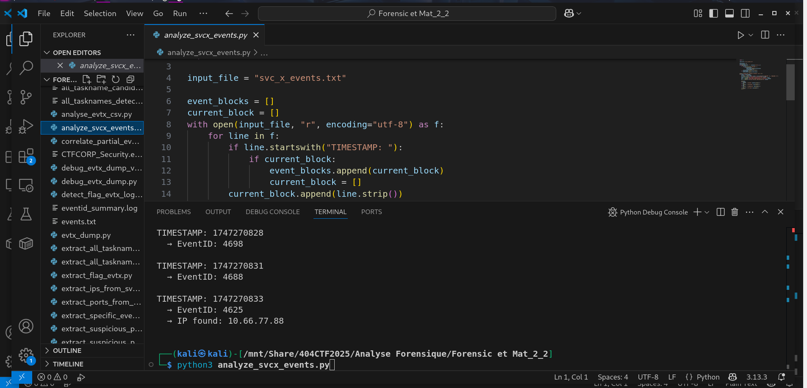
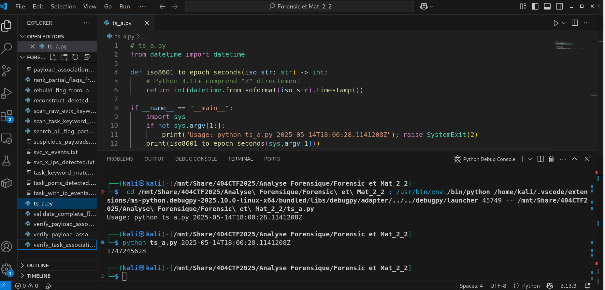

# Solution du challenge : Forensic et mat_2_2

Bienvenue dans le dépôt de **Analyse Forensique/Forensic et Mat 2_2**.

## Enoncé du sujet






## Fonctionnalités

- **La solution expliquée** : Forensic_et_Mat_2_2 (Fichier PDF).
- **La synchronisation de source** : CTFCORP_Security.evtx (windows)
- **La résolution de la source** : flag_candidates_log (TXT)
- **L'extraction de source** : detect_flag_evtx_log.py (script)
- **La conversion de TIMESTAMP** : ts_a.py (script)

## Installation

1. **Cloner le dépôt** :
   ```bash
   git clone https://github.com/JackeOLantern/404CTF2025.git

...
