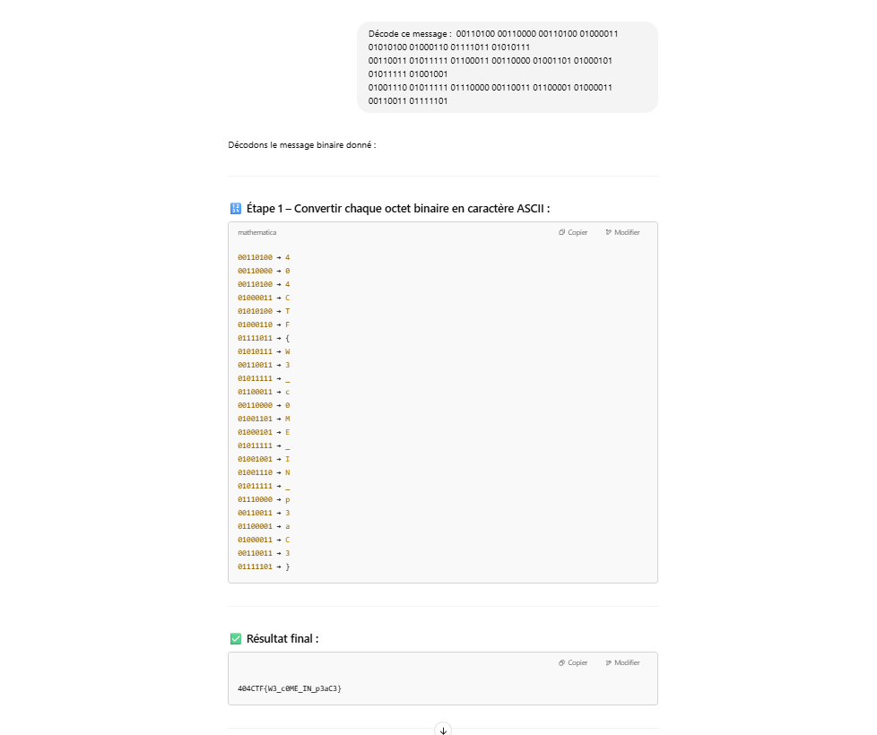

# Solution du challenge : USB 51

Bienvenue dans le dépôt de **Analyse Forensique/USB 51**.

## Enoncé du sujet





## Constat
Une phrase binaire est découverte au sein d'un document extrait.
Il est aisé de voir un encodage depuis les caractères : ASCII.
Il suffit de décoder chaque caractère de la table pour le flag.

## Fonctionnalités

- **La solution expliquée** : bintoascii.png (Fichier PNG).
- **La synchronisation de source** : capture.pcapng (Script PY)
- **La résolution de la source** : exfiltrated_document (PDF)
- **L'outil d'extraction de source** : pdf-parser.py (script)

## Installation

1. **Cloner le dépôt** :
   ```bash
   git clone https://github.com/JackeOLantern/404CTF2025.git

...
