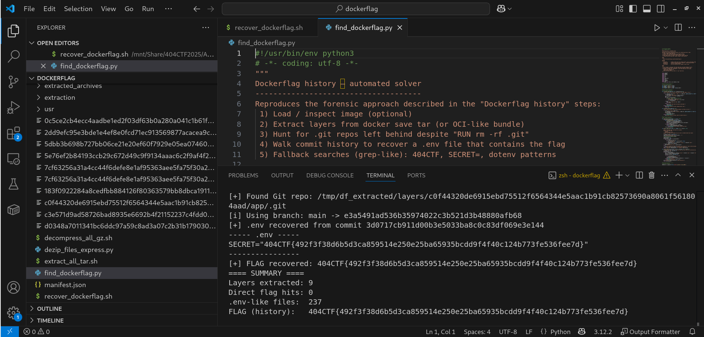

# Solution du challenge : Dockerflag

Bienvenue dans le dépôt de **Analyse Forensique/Dockerflag**.

## Enoncé du sujet




## Constat
Le secret s'est avéré empilé en dépôt git sous-jacent extrait du lot compressé.

## Fonctionnalités

- **La solution expliquée** : solution.png (Fichier PNG).
- **La synchronisation de source** : dockerflag.tar (TAR) + simulation (PNG)
- **La résolution de la source** : Dockerflag (PDF) + correction (PNG)
- **L'outil d'extraction de source** : find_dockerflag.py (script)

## Installation

1. **Cloner le dépôt** :
   ```bash
   git clone https://github.com/JackeOLantern/404CTF2025.git

...
