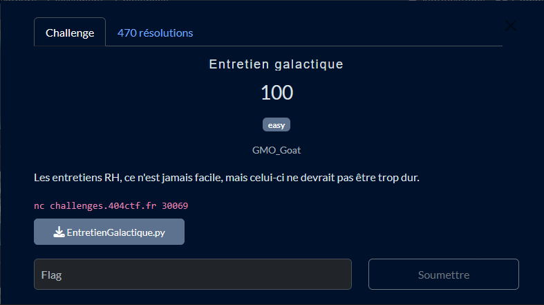

# Solution du challenge : Entretien Galactique

Bienvenue dans le dépôt de **Cryptanalyse/Entretien Galactique**.

## Enoncé du sujet



## Fonctionnalités

- **La solution expliquée** : Entretien_galactique (Fichier PDF / Word).
- **La synchronisation de source** : EntretienGalactique.py (Script PY)
- **La résolution de la source** : solve_EntretienGalactique.py (Script PY)

## Installation

1. **Cloner le dépôt** :
   ```bash
   git clone https://github.com/JackeOLantern/404CTF2025.git

...
