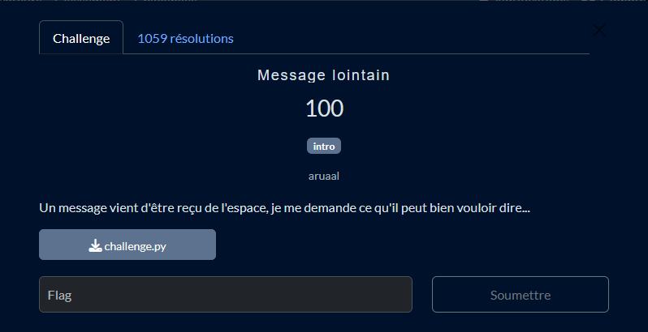

# Solution du challenge : Message lointain

Bienvenue dans le dépôt de **Cryptanalyse/Message lointain**.

## Enoncé du sujet



## Fonctionnalités

- **La solution expliquée** : Message_lointain (Fichier PDF / Word).
- **La synchronisation de source** : challenge.py (Script PY)
- **La résolution de la source** : decode_challenge.py (Script PY)
- **La solution alternative à la source** : decode_challenge_alt.py (Script PY)

## Installation

1. **Cloner le dépôt** :
   ```bash
   git clone https://github.com/JackeOLantern/404CTF2025.git

...
