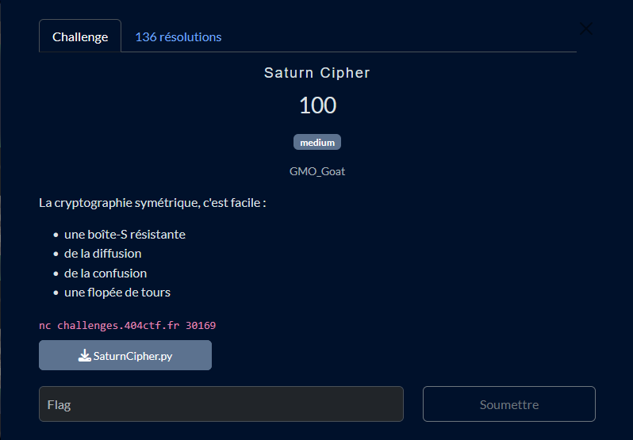

# Solution du challenge : Saturn Cypher

Bienvenue dans le dépôt de **Cryptanalyse/Saturn Cypher**.

## Enoncé du sujet



## Fonctionnalités

- **La solution expliquée** : Saturn Cypher (Fichier PDF / Word).
- **La synchronisation de source** : SaturnCypher.py (Script PY)
- **La résolution de la source** : SaturnCipherExploit.py (Script PY)
- **L'alternative à la résolution** : SaturnCipherNetcat.py (Script PY)

## Installation

1. **Cloner le dépôt** :
   ```bash
   git clone https://github.com/JackeOLantern/404CTF2025.git

...
