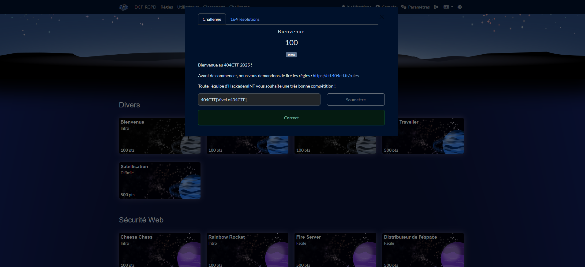

# Solution du challenge : Divers.

Bienvenue dans le dépôt de **Divers/Bienvenue.**

## Enoncé du sujet


La bienvenue est souhaitée et il y a donc une liste de challenges progressivement ouverts, soit d'emblée au sein d'une première vague, soit à la suite à mi-parcours lors d'une deuxième vague.

## Fonctionnalités

Le but est de bien accueillir tous les participants.

- **La résolution de la source** : solution (PNG)

## Installation

1. **Cloner le dépôt** :
   ```bash
   git clone https://github.com/JackeOLantern/404CTF2025.git

...
