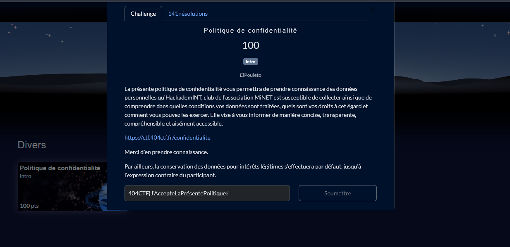
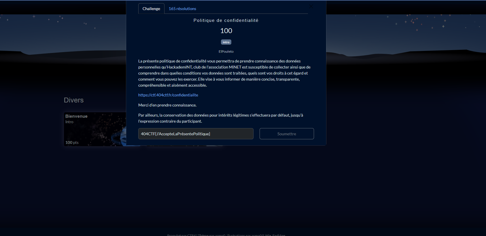

# Solution du challenge : Divers.

Bienvenue dans le dépôt de **Divers/Politique de confidentialité.**

## Enoncé du sujet



Le prérequis avant l'immersion dans les thèmes des défis est d'accepter et d'agréer la plitique de confidentialité du site. Un aval double est souhaité et il y a donc une liste de challenges progressivement ouverts, selon les catégories.

## Fonctionnalités

Le but est de bien "briefer" sur les critères DICT de la cyber.

- **La résolution de la source** : acceptation (PNG)
- **La résolution bis de la source** : agreement (PNG)

## Installation

1. **Cloner le dépôt** :
   ```bash
   git clone https://github.com/JackeOLantern/404CTF2025.git

...
