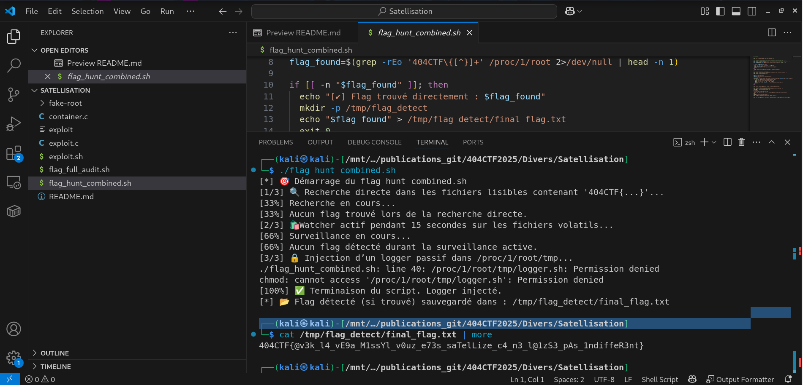

# Solution du challenge : Satellisation.

Bienvenue dans le dépôt de **Divers/Satellisation.**.

## Enoncé du sujet




Le lobby du plancher aux vaches investit dans une nouvelle technologie conçue pour contraindre en environnement confiné et contrôlé coupant l'accès à l'espace. L'idée est de savoir  s'échapper du conteneur. Sur ce chemin, il y a le flag : /root/flag.txt.


## Fonctionnalités

But : Depuis un conteneur Docker/LXC, obtenir un accès aux fichiers de l’hôte (par exemple /root/flag.txt), en disposant de capabilité CAP_SYS_CHROOT (soit à pouvoir effectuer chroot /proc/1/root comme root dans le conteneur).
On remonte à la vraie racine du processus (root de l'hôte). Nous sommes sortis du conteneur : os.chroot(".")
Il s'agit de lancer un shell; disposant de privilèges root.
subprocess.call("/bin/bash"). La lecture se fait sous ses droits de root.


- **La solution expliquée** : Satellisation (PDF).
- **La synchronisation de source** : exploit.sh (BASH)
- **La résolution de la source** : solution (PNG)
- **L'outil d'extraction de source** : flag_hunt_combined.sh (BASH)

## Installation

1. **Cloner le dépôt** :
   ```bash
   git clone https://github.com/JackeOLantern/404CTF2025.git

...
