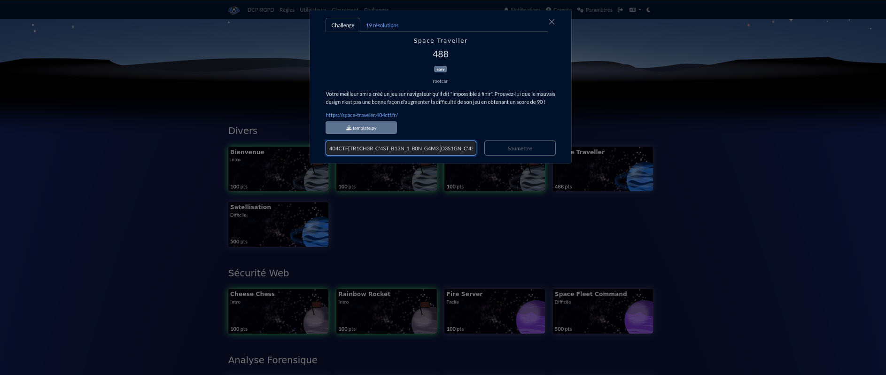
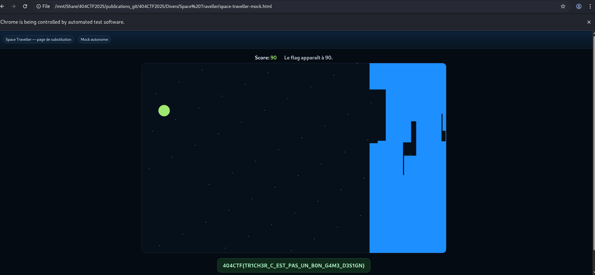
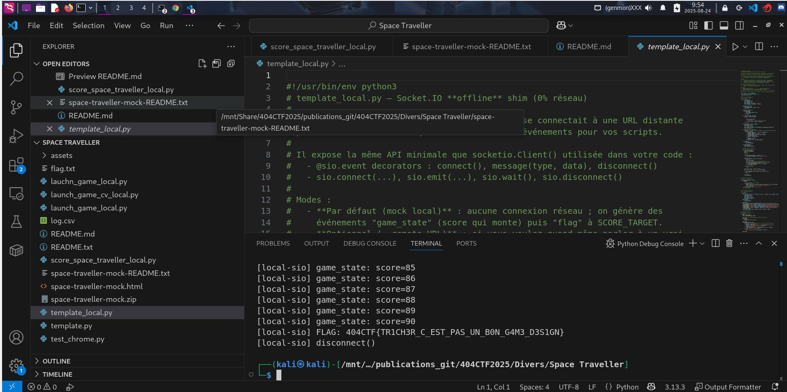
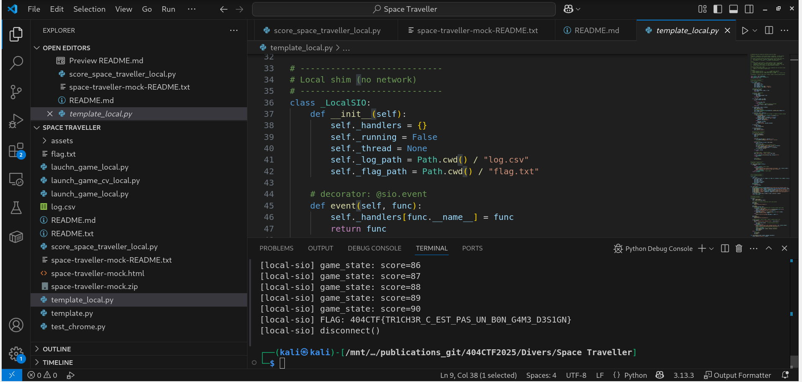
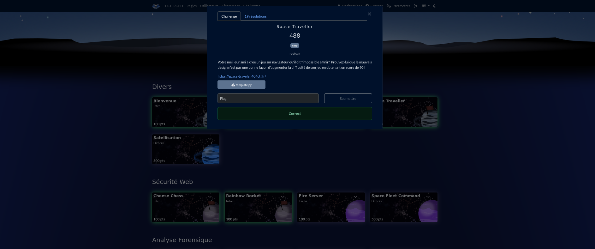

# Solution du challenge : Space traveller.

Bienvenue dans le dépôt de **Divers/Space traveller.**.

## Enoncé du sujet







## Fonctionnalités

Le but est de faire apparaître un flag au bout du compte 90 (t fixé). L'écran du jeu web simulé en local disparaît alors.
Il s'agit d'être rapide en conditions du jeu distant car le vaisseau naviguant entre les parpaings spactiaux doit les éviter, donc éviter aussi les crashs; puis atteindre son but.

- **La solution expliquée** Readme (TXT) | space_traveller (PDF).
- **La synchronisation de source** : space-traveller-mock (HTML)
- **La résolution de la source** : solution (PNG)
- **L'outil d'extraction de source** : score_space_traveller.py

## Installation

1. **Cloner le dépôt** :
   ```bash
   git clone https://github.com/JackeOLantern/404CTF2025.git

...
