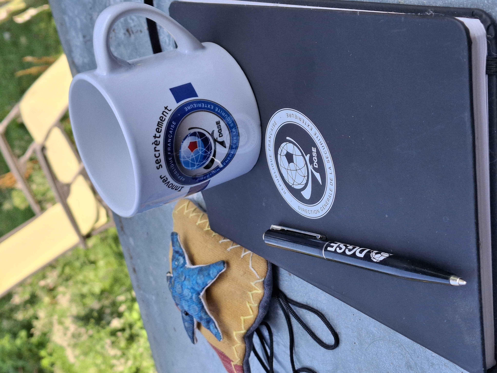

# __404 CTF__ 2025 : passé...et courant. CTF WriteUps !
## __Résumé__
Coorganisé par l'Institut Polytechnique via __Télécom SudParis__ et le ministère des armées via la __direction générale de la sécurité extérieure__, le __404 CTF__ est la plus grande compétition de cybersécurité de France. Après le succès de l'édition 2024 qui célébrait la les grandes figures du sport de la __DGSE__, cette 4ème édition a mis à l'honneur les grandes étapes de la conquête spatiale, avec la géographie et l'histoire d'Ariane et de l'ISS. Le __404 CT__ est de retour au calendrier : *10/05/2025 - 01/06/2025*. Il aborde donc le thème du domaine spatial. Pendant un mois, vous vous êtes confronté à des challenges conçus par le club de cybersécurité __HackademINT__ de __Télécom SudParis__. Le scénario et l'écrit en règles sont décrits. https://ctf.404ctf.fr. La cérémonie de rencontre a lieu au salon __Vivatech__ à Paris : https://vivatechnology.com/ : l'occasion de rencontrer les cent-vingt-cinq premiers invités à la cérémonie des prix comme les cent invités de l'an dernier et d'échanger avec les participants sur invitation de l'équipe organisatrice.

## __Exposé__
Le 404CTF est dans sa quatrième édition en 2025. Il est organisé avec les catégories d'épreuves similaires à l'édition d'avant. Les thèmes groupent 80 épreuves. Le dépôt : *https://github.com/HackademINT/404CTF-2025*  

## __Edition__
Les réponses sauront être diffusées au présent et à venir. Il y a des thèmes fixés par le code en langage dédié ayant servi à leur résolution. *https://github.com/JackeOLantern/404CTF2025* 

## __Logique__
Les questions sont exprimées à travers le *pop down*. C'est le libellé d'énoncé faisant souvent mention du lien internet. Il y a aussi des fichiers d'aides accompagnants associés.

## __Writeup__
Plusieurs solutions sont à présent émises en représentation de Write-up à la résolution. 

## __Attention__
L'ensemble des challenges est accessible à la consultation en ligne dans le même environnement que la réalisation jusqu'aux Fora. Puis, le portail sera remis en service. L'ensemble va être vraisemblablement aussi désinstallé à l'issue des représentations...
