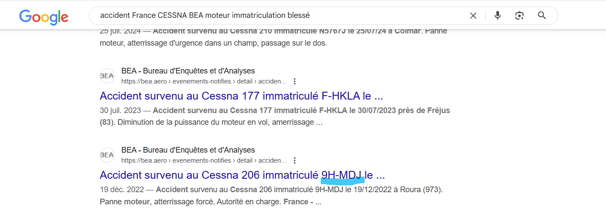
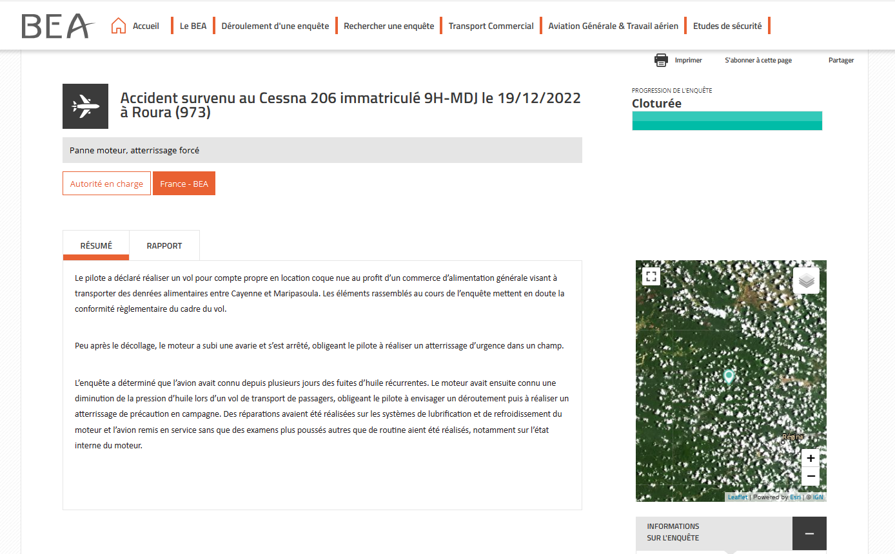
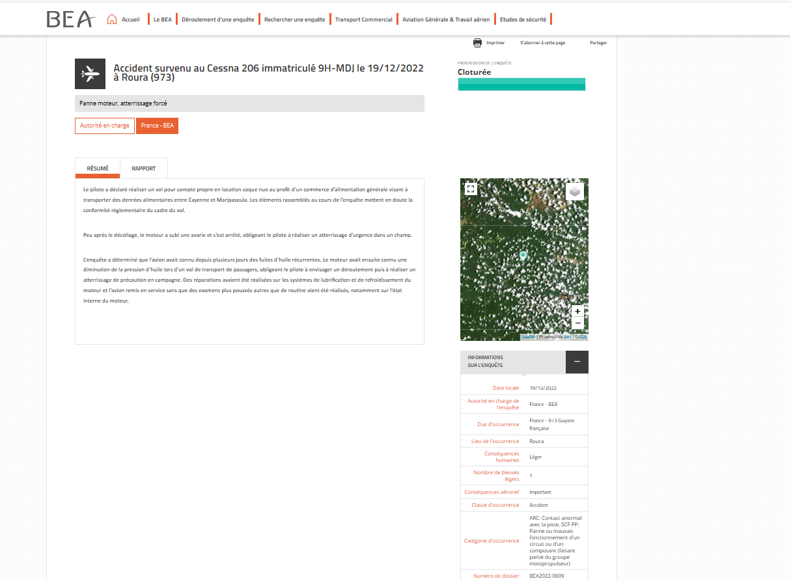

# Solution du challenge : Earth_Attack_0_2

Bienvenue dans le dépôt de **Renseignement en sources ouvertes/Earth_Attack_0_2**.

## Enoncé du sujet






## Fonctionnalités

Le but est de trouver l'immatriculation d'un appareil sur enquête.

- **La solution expliquée** : evenement (PNG).
- **La synchronisation de source** : correction (PNG)
- **La résolution de la source** : immatriculation (Google image)
- **L'outil d'extraction de source** : localisation (PNG)

## Installation

1. **Cloner le dépôt** :
   ```bash
   git clone https://github.com/JackeOLantern/404CTF2025.git

...
