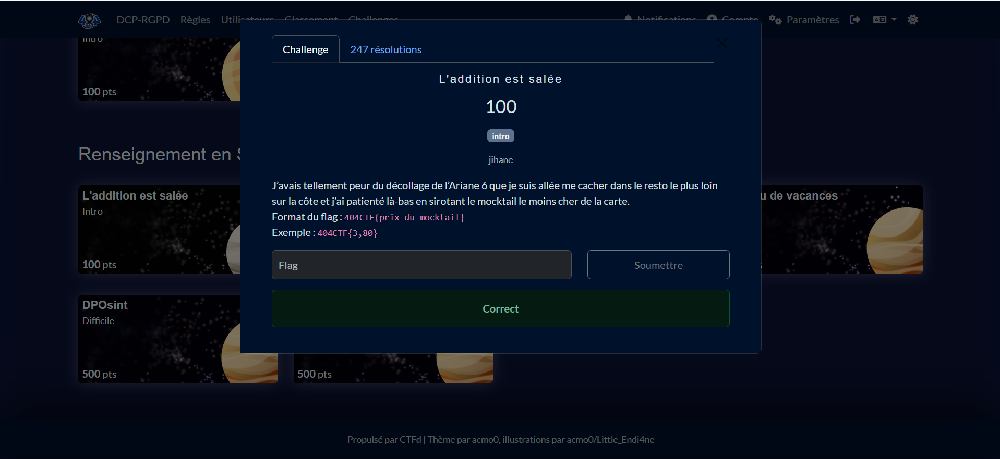
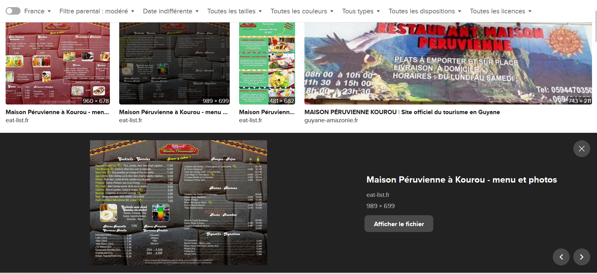
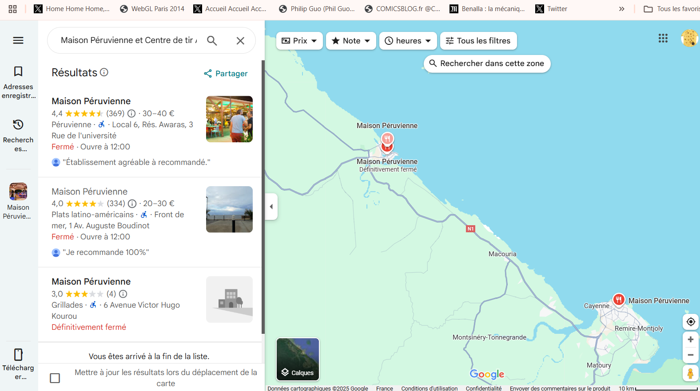
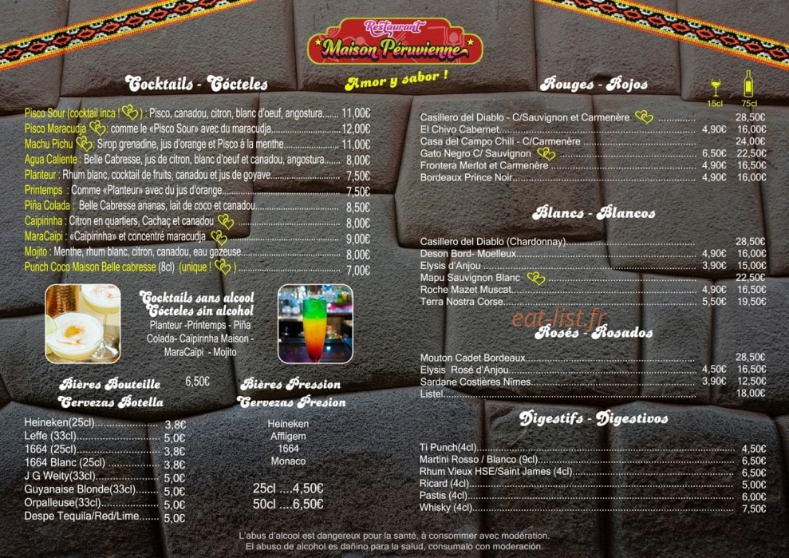
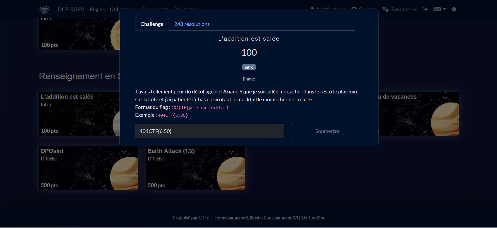

# Solution du challenge : L'addition est salée

Bienvenue dans le dépôt des **Renseignement en sources ouvertes/L'adition est salée**.

## Enoncé du sujet






L'objectif est de dénicher le prix le moins élévé d'un "mocktail" depuis un bar éloigné le plus possible du Centre de tir à Kourou.
Il s'avère que le bar en vogue l'offre à 6,50€!

## Fonctionnalités

- **La solution expliquée** : maison-peruvienne_mocktails (JPG).
- **La synchronisation de source** : Localisation_centre_plage (PNG)
- **La résolution de la source** : correction (PNG)
- **L'outil d'extraction de source** : Google images (en Guyane)

## Installation

1. **Cloner le dépôt** :
   ```bash
   git clone https://github.com/JackeOLantern/404CTF2025.git

...
