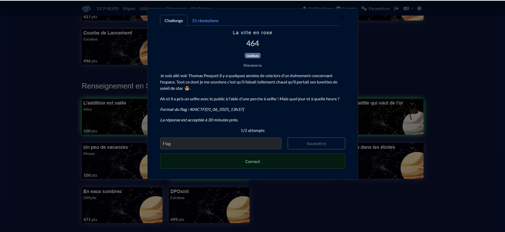

# Solution du challenge : La ville en rose

Bienvenue dans le dépôt des **Renseignement en sources ouvertes/La ville en rose**.

## Enoncé du sujet



L'objectif est l'horaire et le lieu d'un show public de Thomas en lunettes de soleil et GoPro à bout de bras parmi la foule.

## Fonctionnalités

- **La solution expliquée** : La_ville_en_rose (PDF).
- **La synchronisation de source** : Thomas-Pesquet-Cité-Espace (JPG)
- **La résolution de la source** : solution (PNG)
- **L'outil d'extraction de source** : Google images

## Installation

1. **Cloner le dépôt** :
   ```bash
   git clone https://github.com/JackeOLantern/404CTF2025.git

...
