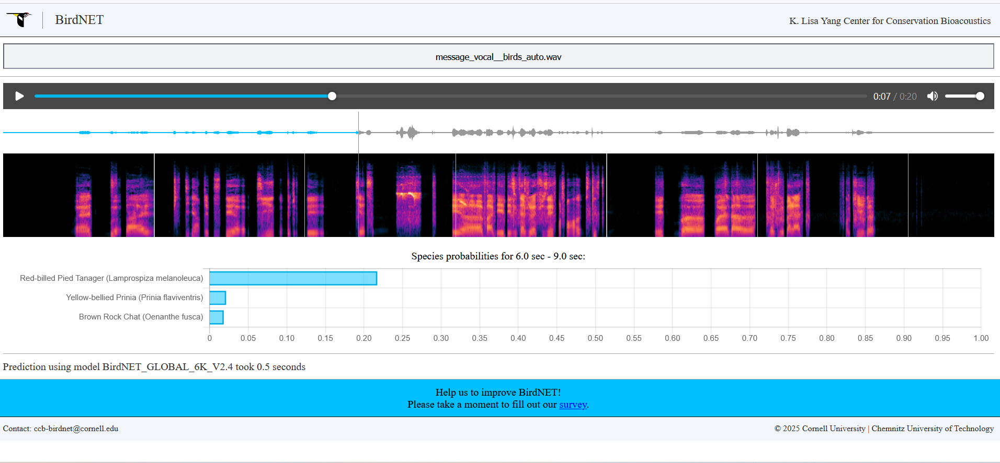
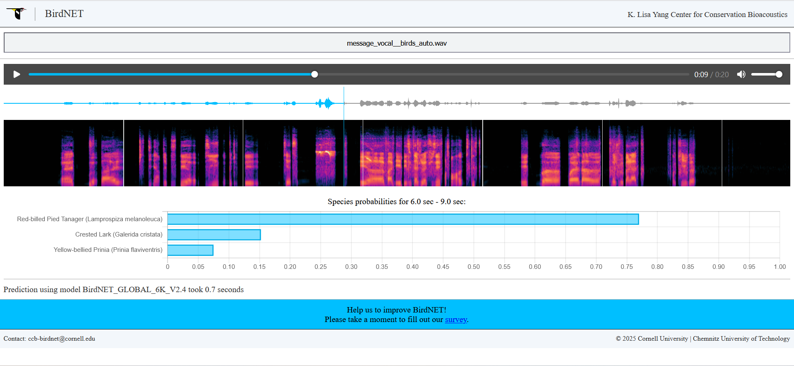

# Solution du challenge : Un peu de vacances

Bienvenue dans le dépôt de **Renseignement en sources ouvertes/Un peu de vacances**.

## Enoncé du sujet




L'objectif est de détecter un indice renseignant sur la localisation de la bande audio: il s'agit de repérer un cri d'oiseau endémique flagrant : en l'occurence un tangara (Guyane) !

## Fonctionnalités

- **La solution expliquée** : transcrire.sh  et BirdNET (site web)
- **La synchronisation de source** : prediction_model (PNG)
- **La résolution de la source** : message_vocal__birds_auto.wav (WAV)
- **L'outil d'extraction de source** : detect_bird_band_no_sf.py (script)

## Installation

1. **Cloner le dépôt** :
   ```bash
   git clone https://github.com/JackeOLantern/404CTF2025.git

...
