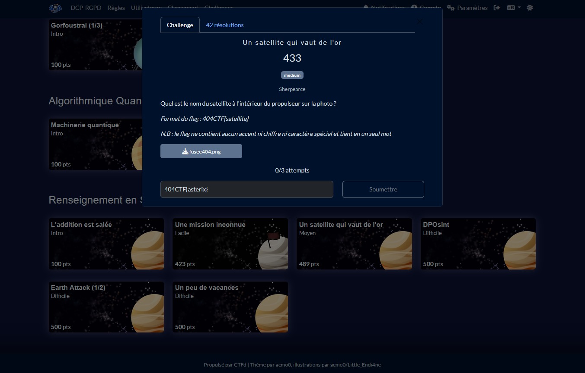

# Solution du challenge : Un satellite qui vaut de l'or

Bienvenue dans le dépôt de **Renseignement en sources ouvertes/Un satellite qui vaut de l'or**.

## Enoncé du sujet





## Fonctionnalités

- **La solution expliquée** : diapason (PNG).
- **La synchronisation de source** : diamant_hammaguir (PNG)
- **La résolution de la source** : solution (PNG)
- **L'outil d'extraction de source** : tir_eurospace (PNG)

## Installation

1. **Cloner le dépôt** :
   ```bash
   git clone https://github.com/JackeOLantern/404CTF2025.git

...
