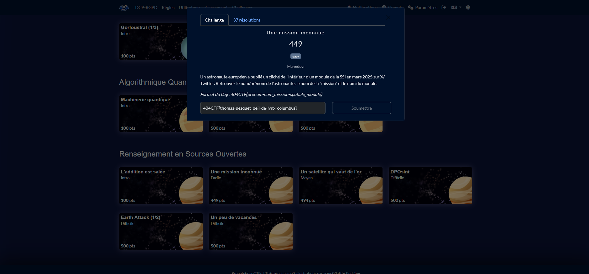
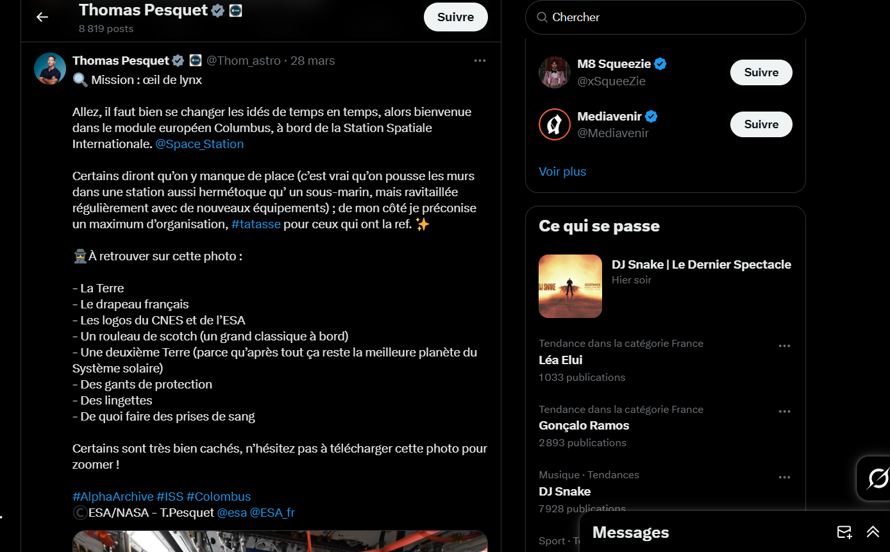
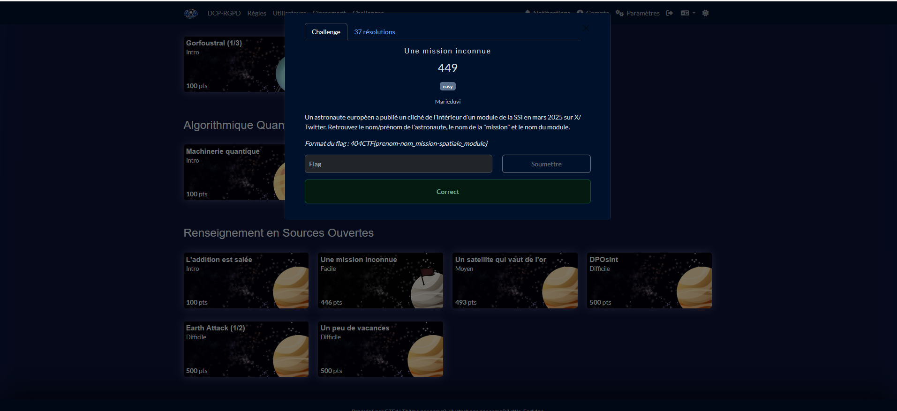

# Solution du challenge : Une mission inconnue

Bienvenue dans le dépôt de **Renseignement en sources ouvertes/Une mission inconnue**.

## Enoncé du sujet





## Fonctionnalités

- **La solution expliquée** : thomas_pesquet_x (PNG - compte).
- **La synchronisation de source** : correction (PNG)
- **La résolution de la source** : solution (PNG)
- **L'outil d'extraction de source** : navigation twitter/x

## Installation

1. **Cloner le dépôt** :
   ```bash
   git clone https://github.com/JackeOLantern/404CTF2025.git

...
