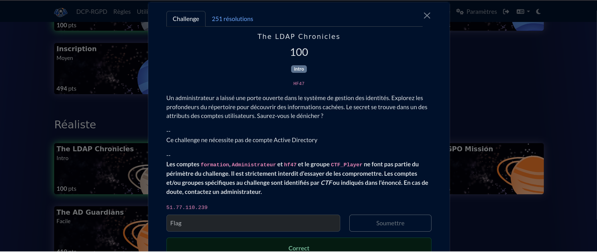
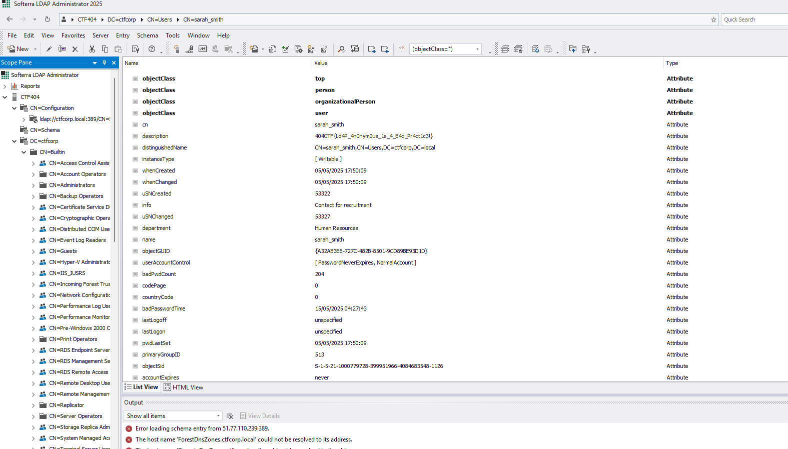
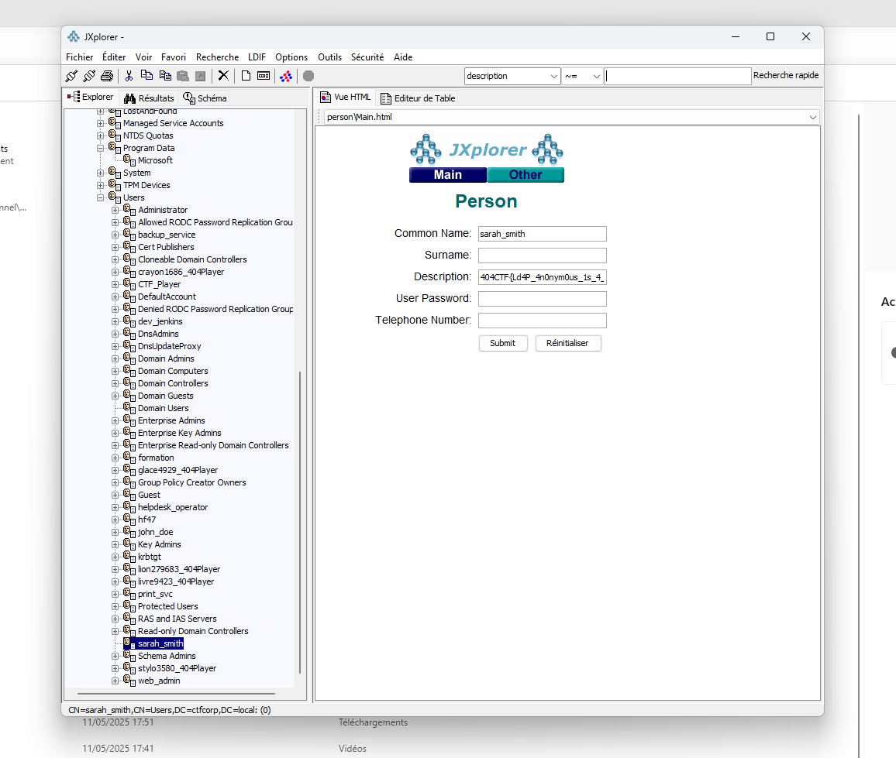
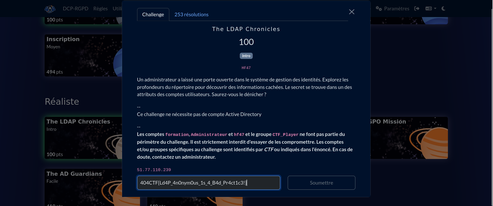

# Solution du challenge : Réaliste.

Bienvenue dans le dépôt de **Réaliste/The LDAP Chronicles.**

## Enoncé du sujet



.

## Fonctionnalités

Le parcours d'un répertoire actif d'un annuaire LDAP dans la rubrique des administrateurs nous amène à un compte de nom : Sara Smith et dans sa description, conduit au flag en direct.

- **La solution expliquée** : extraction (PNG).
- **La synchronisation de source** : administrator (PNG)
- **La correction validée** : correction (PNG)
- **La résolution de la source** : solution (PNG)


## Installation

1. **Cloner le dépôt** :
   ```bash
   git clone https://github.com/JackeOLantern/404CTF2025.git

...
