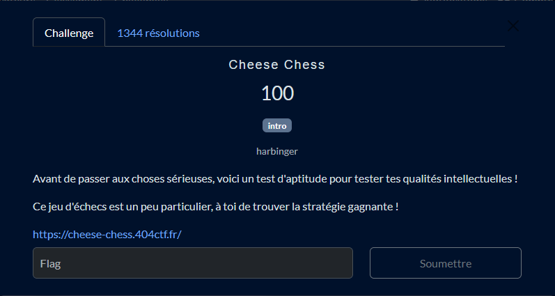
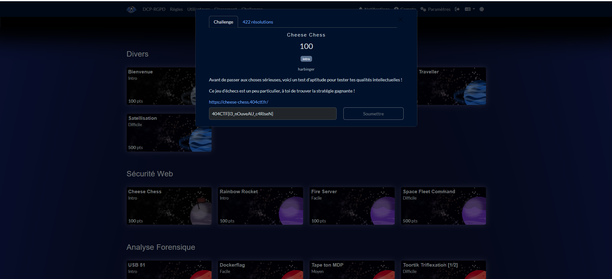
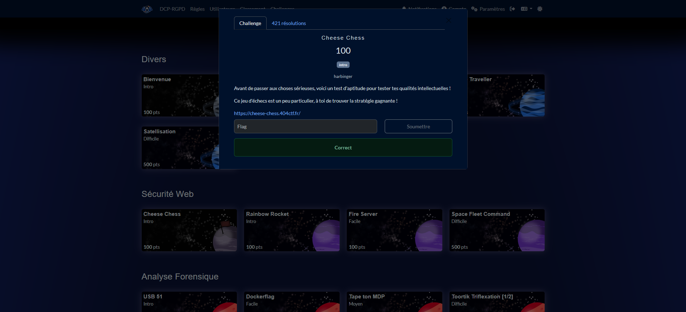

# Solution du challenge : Cheese chess

Bienvenue dans le dépôt de **Séccurité Web/Cheesse Chess**.

## Enoncé du sujet





## Fonctionnalités

- **La solution expliquée** : Cheese_chess (Fichier PDF).
- **La synchronisation de source** : Jeu web (https://cheese-chess.404ctf.fr/)
- - **La correction validée** : correction (PNG)
- **La résolution de la source** : bundle.js (fichier JJS)

## Installation

1. **Cloner le dépôt** :
   ```bash
   git clone https://github.com/JackeOLantern/404CTF2025.git

...
