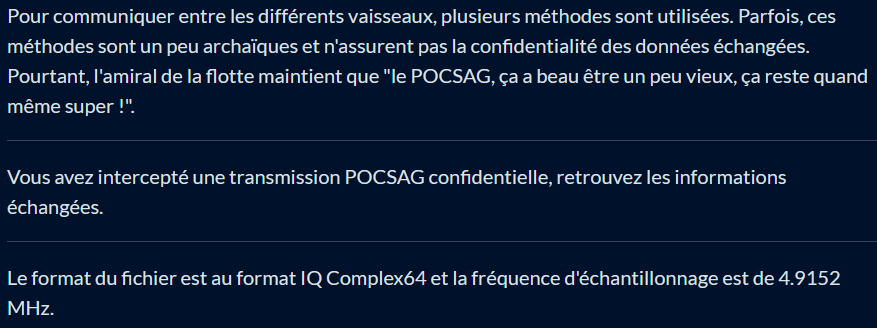
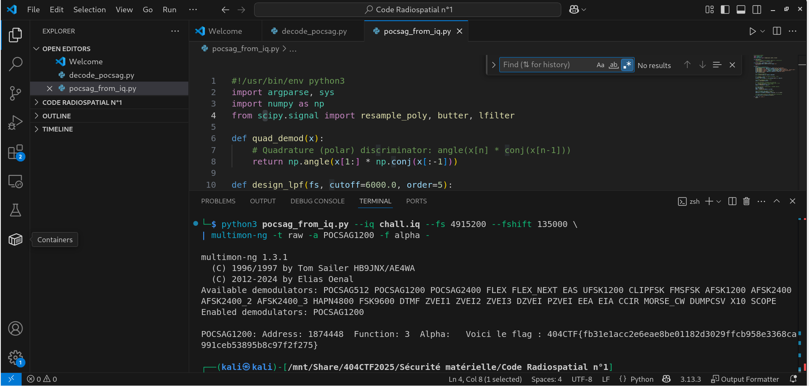
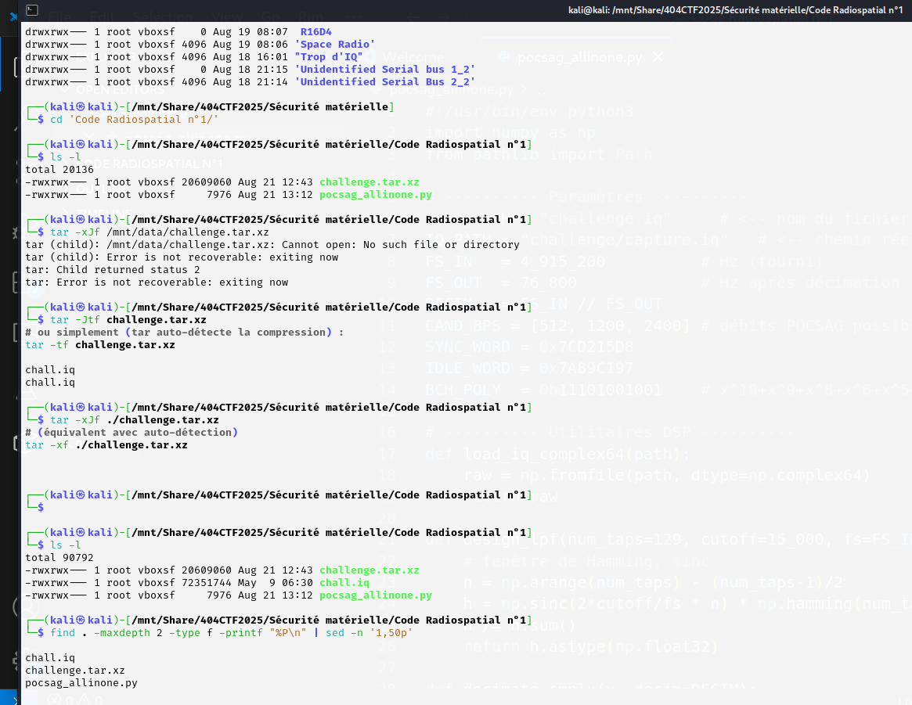
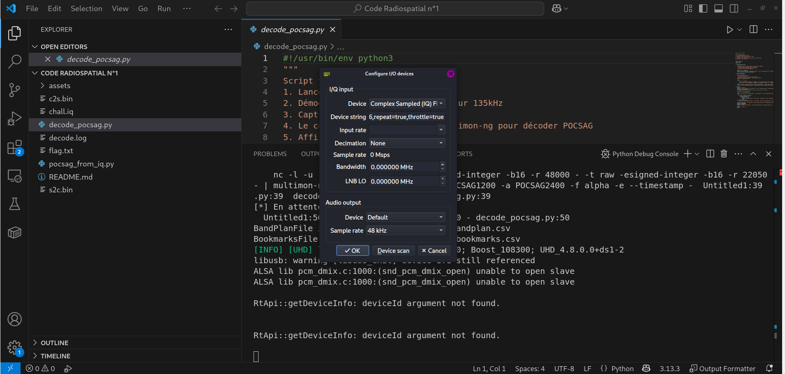
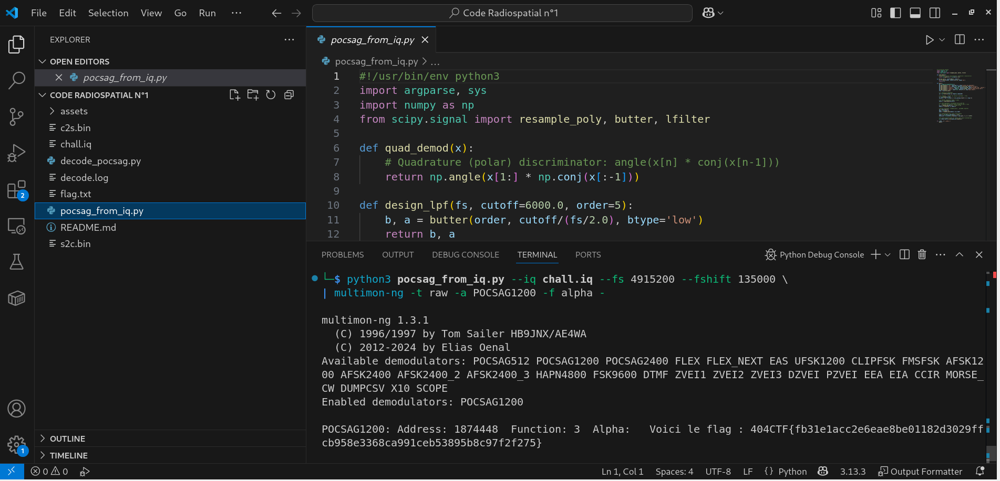
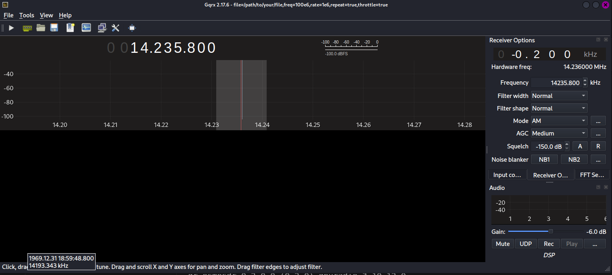

# Solution du défi : Code Radiospatial n°1

Bienvenue dans le dépôt de **Sécurité matérielle/Code Radiospatial n°1**.

## Enoncé du sujet









## Fonctionnalités

L'objectif successif est le suivant : 
- Décompresser un fichier IQ chall.iq (Complex64, Fs = 4 915 200 Hz).
- Viser les protocoles à paramétrer : POCSAG (pager), débits 512/1200/2400 bps, modulation 2-FSK (≈ ±4,5 kHz). 
sigidwiki.com
Raveon Technologies
wavecom.ch
- Extraire le flag affiché par un décodeur (au format).

- **La solution expliquée** : Code Radio spatial n°1 (PDF).
- **La synchronisation de source** : interpretation (PNG)
- **La résolution de la source** : solution (PNG)
- **L'outil d'extraction de source** : pocsag_from_iq.py (vs decode_pocsag.py)

## Installation

1. **Cloner le dépôt** :
   ```bash
   git clone https://github.com/JackeOLantern/404CTF2025.git

...
