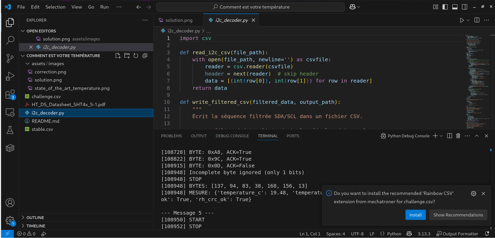

# Solution du challenge : Comment est votre température ?

Bienvenue dans le dépôt de **Sécurité matérielle/Comment est votre température ?**.

## Enoncé du sujet




## Fonctionnalités
La température (T°) et l'hygrométrie (%RH) de la serre sont à retrouver; à partir des ressources fixes avec le numéro de série du capteur d'abord. Et ce lot est à concaténer.

- **La solution expliquée** : solution (PDF).
- **La synchronisation de source** : HT_DS_Datasheet_SHT4x_5-1 (PDF)
- **La résolution de la source** : solution (PNG)
- **L'outil d'extraction de source** : i2c_decoder.py (script)

## Installation

1. **Cloner le dépôt** :
   ```bash
   git clone https://github.com/JackeOLantern/404CTF2025.git

...
