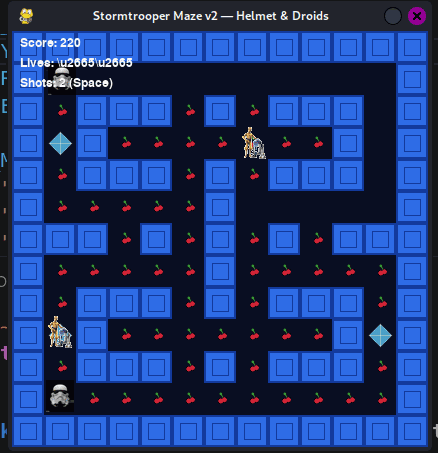
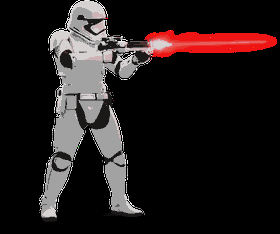
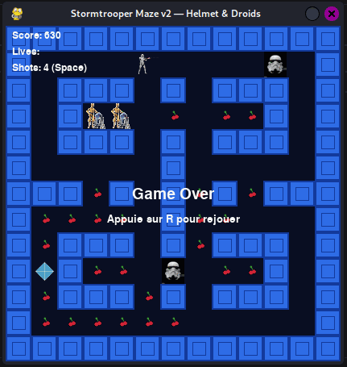

# Solution du défi : Pacman_Jedi_vs_Empire [H.S.]

Bienvenue dans le dépôt de **Sécurité matérielle/Pacman_Jedi_vs_Empire**.

## Enoncé du sujet






## Fonctionnalités
Le but est de voir PacMan évolutif. Le thème est libre de droit.
(Humour).

- **La solution expliquée** : Pacman_Jedi_vs_Empire (PDF).
- **La synchronisation de source** : courant_animated_small (GIF)
- **La résolution de la source** : wargame (PNG)
- **L'outil d'extraction de source** : pacman_stormtrooper_v2.py

## Installation

1. **Cloner le dépôt** :
   ```bash
   git clone https://github.com/JackeOLantern/404CTF2025.git

...
