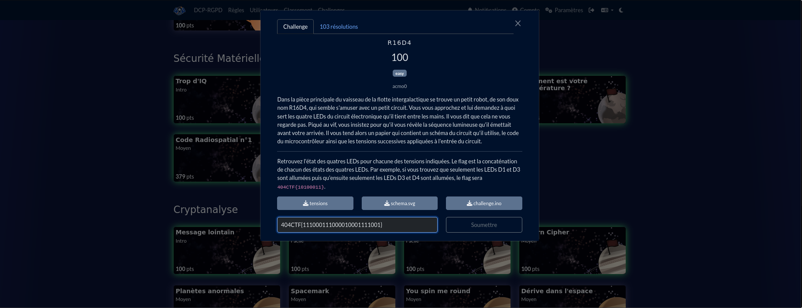
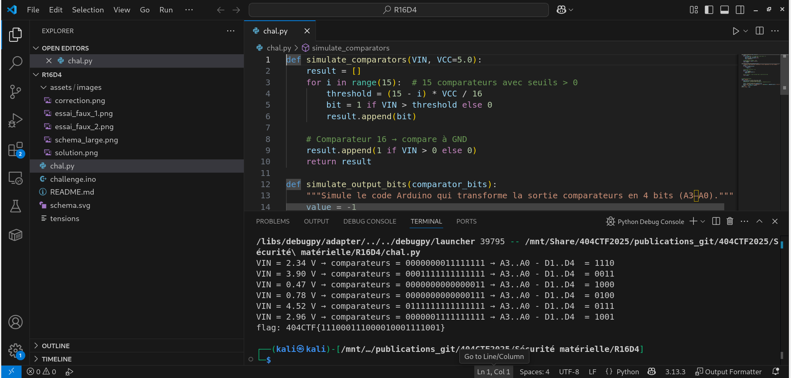
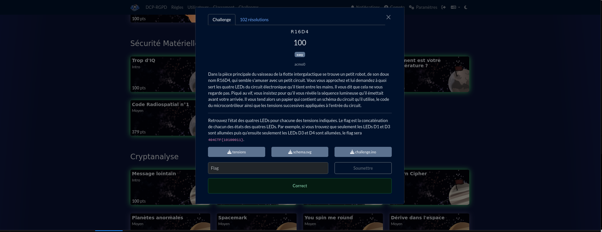
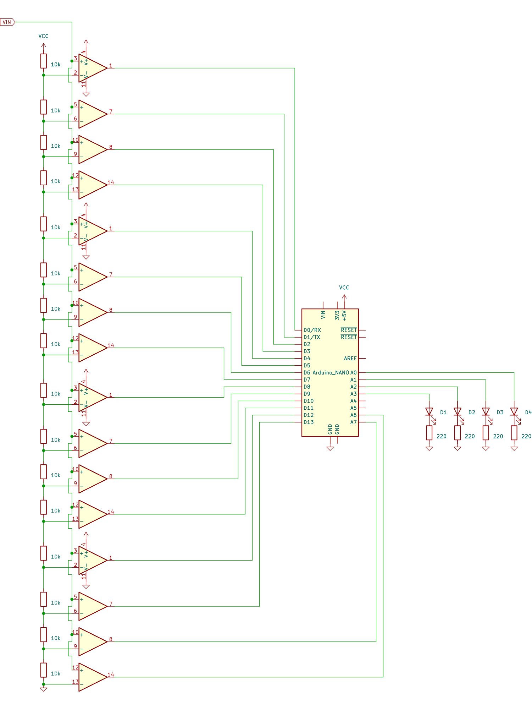
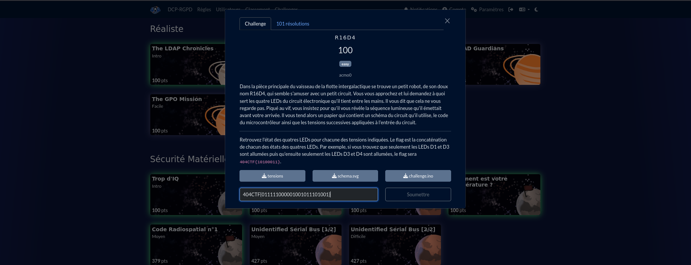

# Solution du challenge : R16D4.

Bienvenue dans le dépôt de **Sécurité matérielle/R16D4**.

## Enoncé du sujet




Des essais intermédiaires donnaient un état erroné.




## Fonctionnalités
Il s'agit d'un schéma électronique en fonctionnement à portes logiques numériques.
Le but est de décoder les sorties à partir des entrées et des tables de vérité des circuits et passerelles. Plusieurs essais empiriques ont conduit à la compréhensionn de la programmation : il s'en déduit l'état des diodes en fonction des AOP, de l'Arduino intermédiaires. L'état éteint correspond à 0 et l'état 1 lordsque allumées,par exemple.

- **La solution expliquée** : R16D4(PDF).
- **La synchronisation de source** : schema_large (PNG)
- **La résolution de la source** : solution (PNG)
- **L'outil d'extraction de source** : chall.py (script)

## Installation

1. **Cloner le dépôt** :
   ```bash
   git clone https://github.com/JackeOLantern/404CTF2025.git

...
