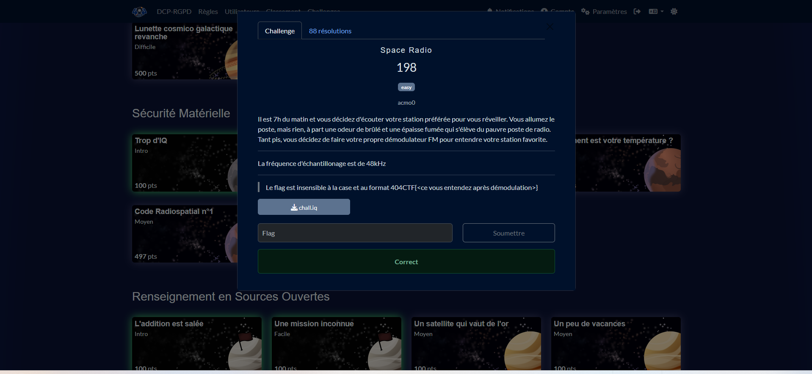
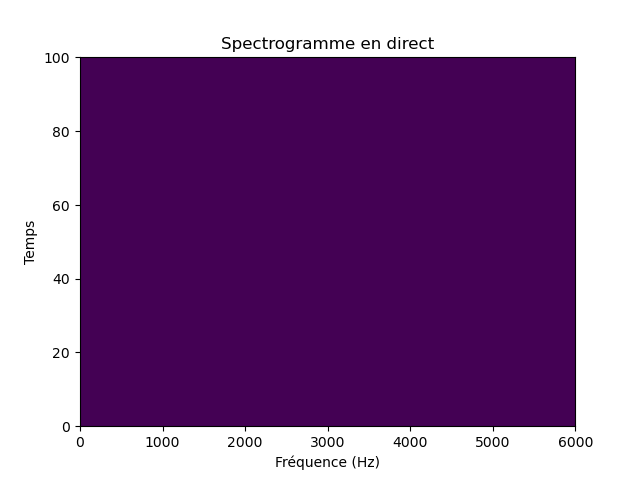

# Solution du challenge : Space Radio

Bienvenue dans le dépôt de **Sécurité matérielle/Space Radio**.

## Enoncé du sujet




[🔊 Écouter le sample (WAV)][wav]

[wav]: assets/audio/fm_demodulated.wav

## Fonctionnalités

Le but est de trouver l'immatriculation d'un appareil sur enquête.

- **La solution expliquée** : solution (PNG).
- **La synchronisation de source** : correction (PNG)
- **La résolution de la source** : space_radio.pdf 
- **Le démodulateur de FM** : demodulateur_FM.py
- **L'outil d'extraction de source** : fm_demodulated.wav (Audio)

## Installation

1. **Cloner le dépôt** :
   ```bash
   git clone https://github.com/JackeOLantern/404CTF2025.git

...
