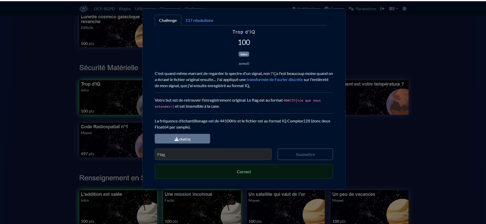
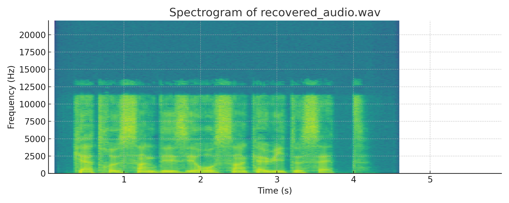

# Solution du challenge : Trop d'I.Q.

Bienvenue dans le dépôt de **Sécurité matérielle/Trop d'I.Q.**.

## Enoncé du sujet




[🔊 Écouter le sample (WAV)][wav]

[wav]: recovered_signal.wav


## Fonctionnalités

Le but est de décoder le signal audio et le mot manifeste caché intérieur.Par Python avec NumPy : on a appliqué numpy.fft.ifft pour inverser le spectre complexe IQ et retrouver le signal temporel, puis on l’a écrit en WAV avec le module standard wave. (Contexte IQ : échantillons I/Q = complexe).

- **La solution expliquée** : Trop_d_IQ (PDF).
- **La synchronisation de source** : spectrogram_recovered (PNG)
- **La résolution de la source** : solution (PNG)
- **L'outil d'extraction de source** : Numpy

## Installation

1. **Cloner le dépôt** :
   ```bash
   git clone https://github.com/JackeOLantern/404CTF2025.git

...
