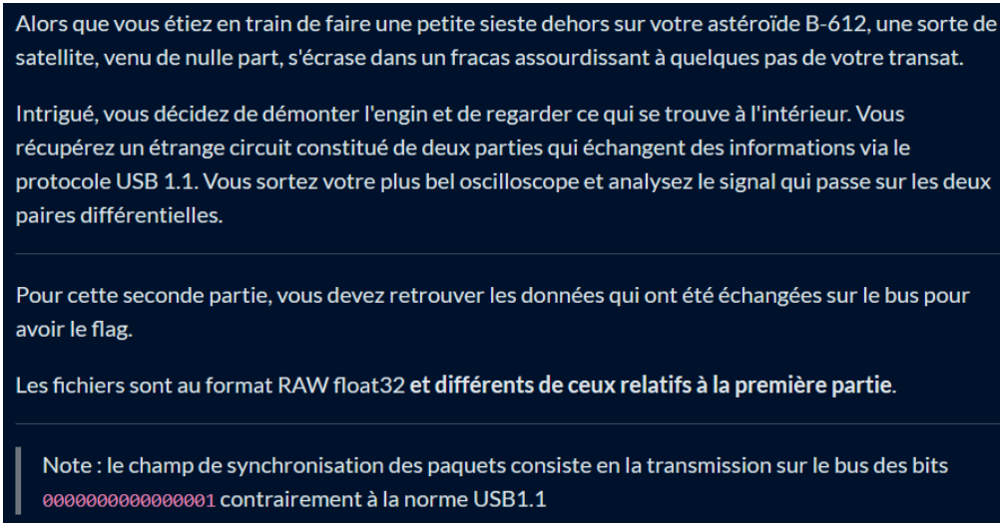
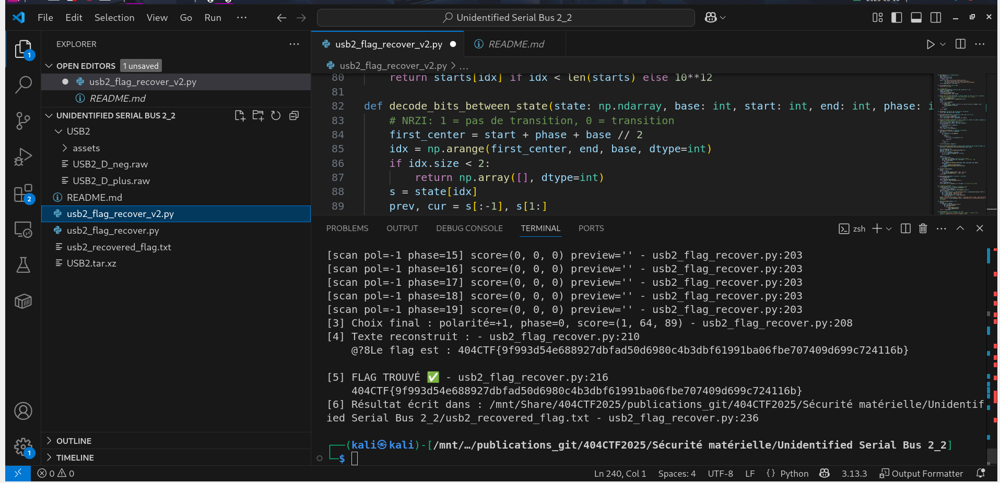

# Solution du challenge : Unidentified Serial bus 2_2.

Bienvenue dans le dépôt de **Sécurité matérielle/Unidentified Serial bus 2_2.**.

## Enoncé du sujet





## Fonctionnalités

Le but est reconstruire le trafic pour en extraire le flag à partir de deux captures brutes USB 1.1 (lignes D+ et D- en float32).
L’objectif est de détecter les paquets à partir du motif SYNC, de borner chaque trame à l’EOP (SE0), puis de décoder le NRZI pour obtenir les bits et les convertir en octets (LSB-first). En lisant simplement les payloads des trames DATA0/DATA1 et en rassemblant les octets ASCII, on retrouve directement le texte avec l'entête 404CTF{…} — pas besoin ici de gérer le bit-stuffing ni de vérifier les CRC. En pratique, il faut aussi estimer la période de bit, tester la phase (et au besoin la polarité D+/D-) pour récupérer un flux propre et obtenir le flag complet.

- **La solution expliquée** : USB2_2 (PDF).
- **La synchronisation de source** : usb2_recovered_flag.txt (PNG)
- **La résolution de la source** : solution (PNG)
- **L'outil d'extraction de source** : [analyze_data_upd.py](usb2_flag_recover_v2.py) (script)

## Installation

1. **Cloner le dépôt** :
   ```bash
   git clone https://github.com/JackeOLantern/404CTF2025.git

...
