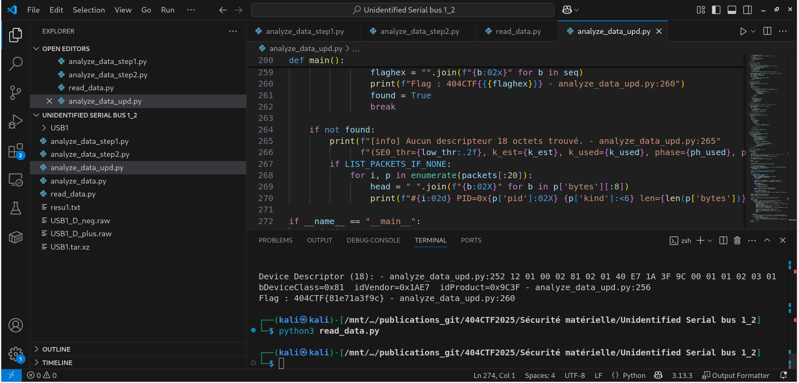
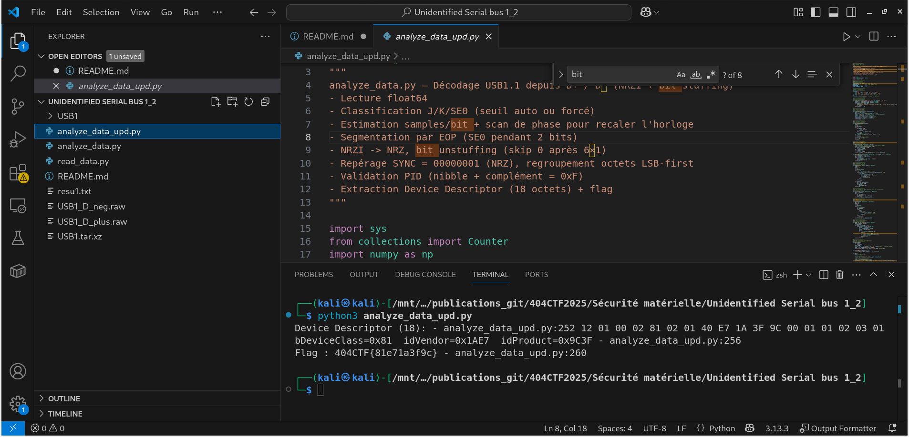

# Solution du challenge : Unidentified Serial bus 1_2.

Bienvenue dans le dépôt de **Sécurité matérielle/Unidentified Serial bus 1_2.**.

## Enoncé du sujet





## Fonctionnalités

Le but est en bref : reconstituer un échange USB 1.1 depuis les traces brutes D+/D–, les convertir en bits (décimation, NRZI + retrait du bit-stuffing), repérer SYNC/PID, extraire le Device Descriptor et en déduire le flag. La récupération sur internet d'une norme USB1.1 est utile (site miroir)

- **La solution expliquée** : USB1_2 (PDF).
- **La synchronisation de source** : USB1.1 en caractéristiques [USB1.1](https://www.alsa-project.org/files/pub/manuals/usb/usb11.pdf) 
- **La résolution de la source** : solution (PNG)
- **L'outil d'extraction de source** : analyze_data_upd.py (script)

## Installation

1. **Cloner le dépôt** :
   ```bash
   git clone https://github.com/JackeOLantern/404CTF2025.git

...
